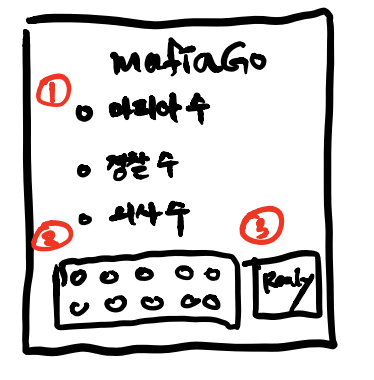
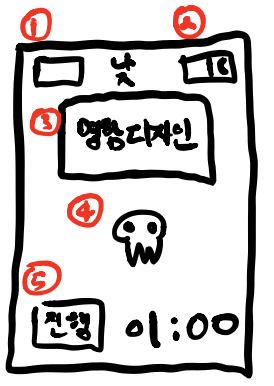
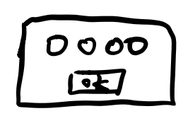
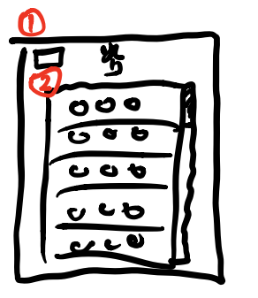
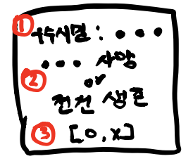
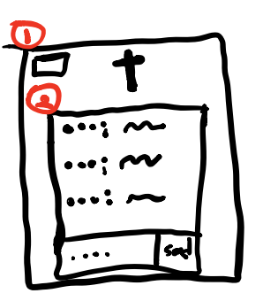

# mafiaGO

## UI

- 메인페이지(smalldragon.net)

1. 셋팅창

   - 마피아수
     - 마피아 수를 정함 (최소 1명)
   - 경찰 수
     - 경찰 수를 정함 (최소 0명)
   - 의사 수
     - 의사 수를 정함 (최소 0명)

2. 참가자 상태창

   - 참가자들이 접속을하면 아래와 같은 창에 자기 이름을 적음

     

   - 참가자 상태창에 푸른 원이 생성됨.

   - 3번의 레디버튼을 누르면 준비상태가 되며 빨간원으로 전환

     - 전원이 준비상태가 되면 세션을 초기화하고 게임 시작

       

- 낮(smalldragon.net/day)

  

1. 사용자 표시창
   - 사용자의 이름 정보를 표시함
   - 기본적으로 배경색과 같게하여 안보이도록 디자인함
     - 재접속시 해당 칸을 클릭하여 자신의 이름을 적고 게임을 이어나가기 위함

2. 밤 스위치

   - 밤으로 갈 준비 상태로 전환하는 스위치
   - 한 번 밤으로 전환하면 다음날 낮이 될 때까지 전환 불가
     - 중복 처리 방지를 위함
   - 참가자 전원이 밤으로 갈 준비상태가 되면 밤으로 전환

3. 참가자 직업 확인

   - 참가자의 직업을 확인하기 위한 용도. 재미를 위해 참가자의 이름도 넣을 예정
   - 클릭을 하면 직업란에 참가자의 직업을 나타냄
     - 클릭할때마다 토글형식으로 직업을 나타내거나 없앨 수 있음

4. 사망 신고 버튼

   - 게임을 진행하면서, 마피아 혹은 투표로 인해 사형선고를 당한 경우, 스스로 클릭하여 사망을 표시함

   - 실수로 누를 것을 방지하여 같은 번호 4번을 입력하는 창을 통해 사망 상태로 전환

     

   - 사망 시 망자톡 페이지로 이동

5. 진행 버튼

   - 토론이 길어질 경우를 대비하여 1분의 카운트 다운을 시작하는 버튼

   - 클릭시 누가 클릭했는지 참가자 전원에게 알림

   - 카운트 다운이 끝나면 알림 메시지만 띄워줌

     

- 밤(smalldragon/night)

  

1. 사용자 표시창
   - 낮 페이지의 사용자표시창과 용도가 같음
2. 참가자 선택창
   - 참가자 목록을 볼 수 있으며, 특저 참가자를 클릭하면 직업에 맞는 기능이 수행됨
     - 시민
       - 우수 시민 대상을 지목
       - 시민들 중 최다 투표를 받은 자는 낮으로 전환될 때 메시지를 표시함
     - 마피아 
       - 죽일 상대를 지목 
       - 마피아는 여러명이 있을 수 있으나, 대표 마피아를 랜덤으로 지정하여 죽일 대상을 선택
       - 모든 마피아들이 클릭하기 때문에 대표 마피아가 누군지 알필요는 없음
         - 만약 대표 마피아가 죽는다면, 다시 남아있는 마피아중 대표 마피아를 랜덤으로 지정
       - 마피아는 우수 시민 대상을 지목할 수 없음. 즉 대표가 아닌 일반 마피아는 클릭을해도 아무런 효과가 없음
     - 의사
       - 살릴 상대를 지목
       - 우수 시민 투표권은 없음

- 공지창

  

1. 우수 시민

   - 우수 시민 투표 결과 1등을 알려줌
     - 공동 1등일 경우 모두 표시

2. 사망 결과

   - 마피아가 죽인 참가자를 나타냄
   - 의사가 적절하게 살렸다면 전원생존을 표시
     - 브금추가

3. 서치 결과

   - 경찰의 경우 서치의 결과를 O,X로 나타냄

     

- 망자톡(smalldragon/dead)

  

1. 사용자 표시창
   - 낮 페이지의 사용자표시창과 용도가 같음
2. 망자톡
   - 망자들끼리 대화를 즐길 수 있음